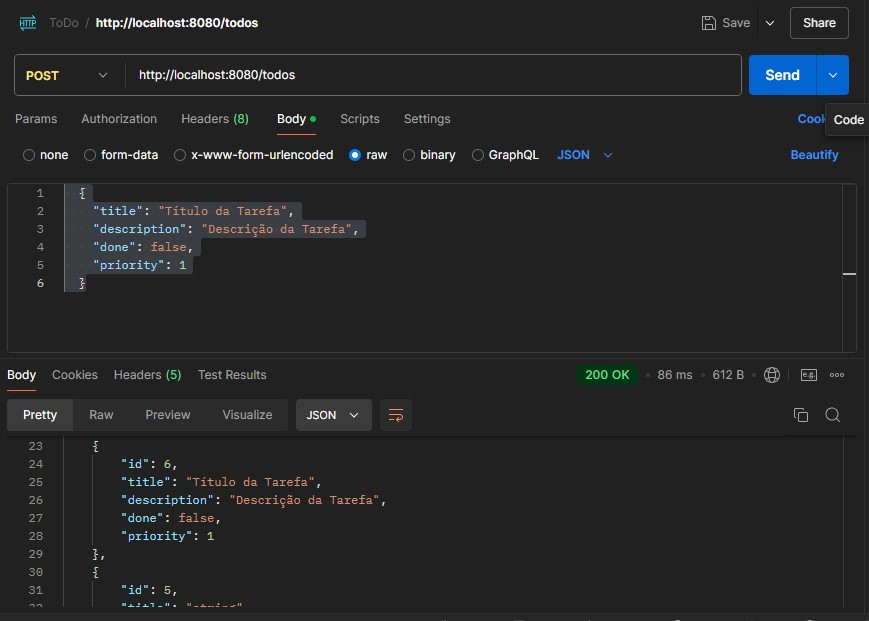

<h1 align="center">
  To-Do List
</h1>

<p align="center">
 
</p>

API para gerenciar tarefas (
CRUD) [Baseado no desafio](https://github.com/simplify-liferay/desafio-junior-backend-simplify) Back-end - Simplify.

API elaborada a partir de um projeto desenvolvido no [YOUTUBE](https://youtu.be/IjProDV001o).

## Tecnologias

- [Spring Boot](https://spring.io/projects/spring-boot)
- [Spring MVC](https://docs.spring.io/spring-framework/reference/web/webmvc.html)
- [Spring Data JPA](https://spring.io/projects/spring-data-jpa)
- [SpringDoc OpenAPI 3](https://springdoc.org/v2/#spring-webflux-support)
- [MySQL](https://dev.mysql.com/downloads/)

## Práticas adotadas

- SOLID, DRY, YAGNI, KISS
- API REST
- Persistência e Consultas de Dados com Spring Data JPA
- Injeção de Dependências
- Tratamento de respostas de erro
- Geração automática do Swagger com a OpenAPI 3

## Como Executar

- Clonar repositório git
- Construir o projeto:

```
$ ./mvnw clean package
```
- Configure o arquivo `src/main/resources/aplication.properties.example`
  - renomeie para `aplication.properties`
  - defina o `username` e `password` do seu MySQL: 

```
spring.application.name=desafio-todolist
spring.datasource.url=jdbc:mysql://localhost:3306/YOUR_DB
spring.datasource.username=YOUR_USER
spring.datasource.password=YOUR_PASSWORD
spring.datasource.driver-class-name=com.mysql.cj.jdbc.Driver

spring.jpa.hibernate.ddl-auto=update
```

- Executar a aplicação:

```
$ java -jar target/desafio-todolist-0.0.1-SNAPSHOT.jar
```

A API poderá ser acessada em [localhost:8080](http://localhost:8080).

## API Endpoints

Para fazer as requisições HTTP abaixo, foi utilizada a ferramenta [Postman](https://www.postman.com/):

- Criar Tarefa

```
$ [POST] http://localhost:8080/todos

  {
    "title": "Título da Tarefa",
    "description": "Descrição da Tarefa",
    "done": false,
    "priority": 1
  }
```

- Retorno do Método
  


- Listar Tarefas

```
$ [GET] http://localhost:8080/todos
```


- Atualizar Tarefa

```
$ [PUT] http://localhost:8080/todos
   {
    "id": 6,
    "title": "Título da Tarefa Alterado",
    "description": "Descrição da Tarefa Alterada",
    "done": true,
    "priority": 10
   }
```
- Retorno do Método


- Remover Tarefa

```
[DELETE] http://localhost:8080/todos/{id}
```

## Swagger UI
```
http://localhost:8080/swagger-ui/index.html
```

